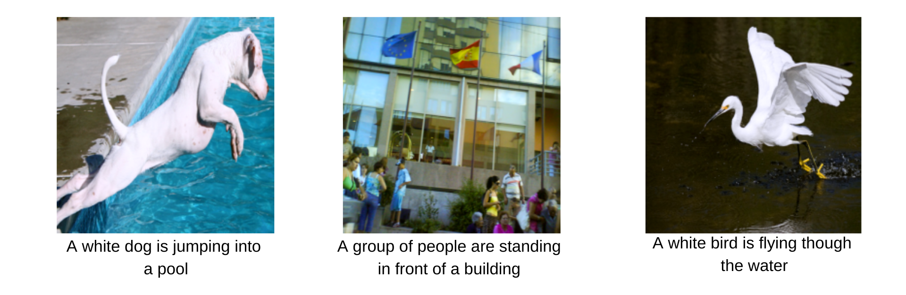
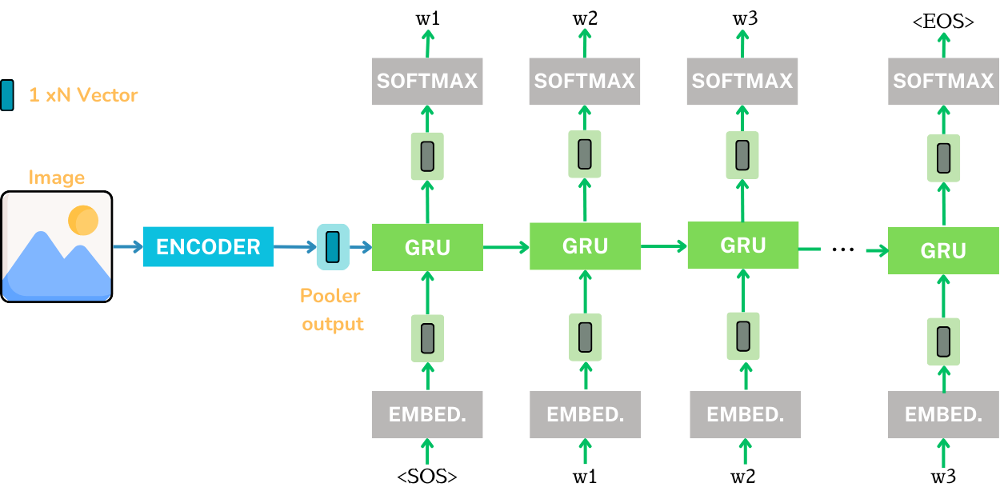
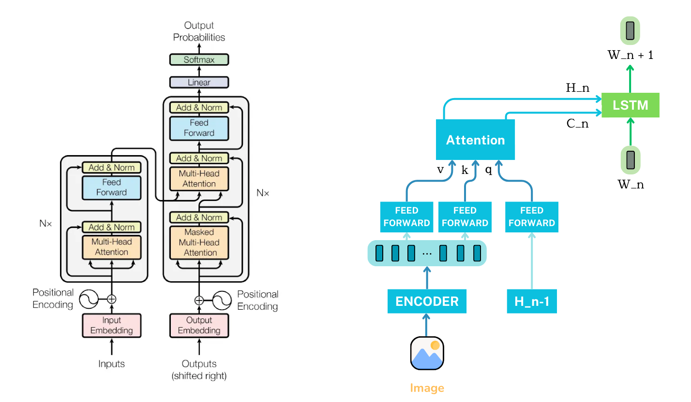
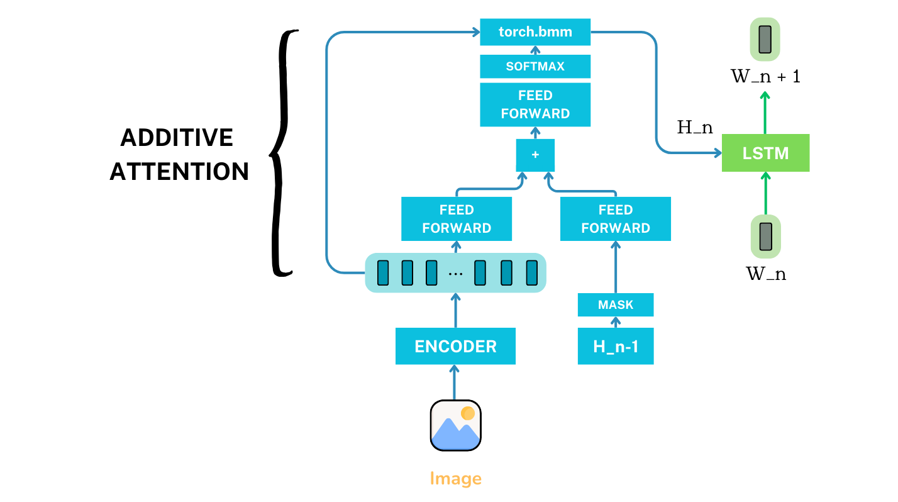
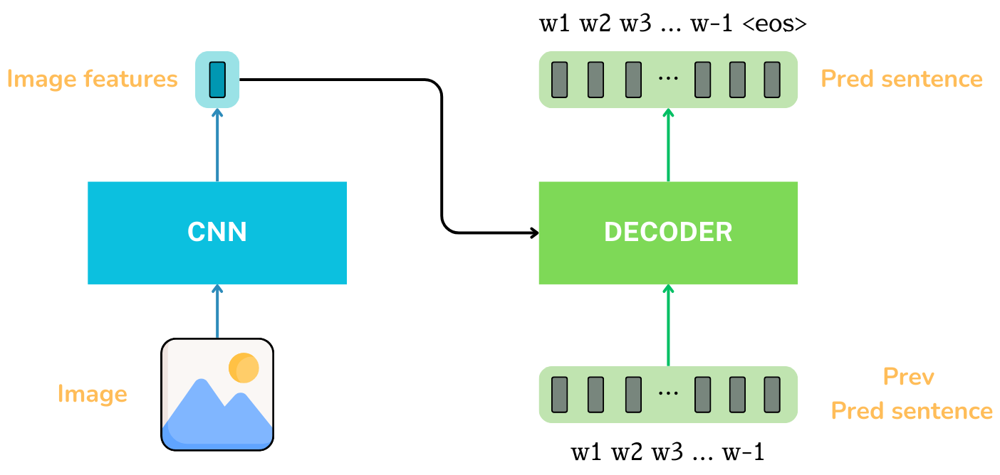
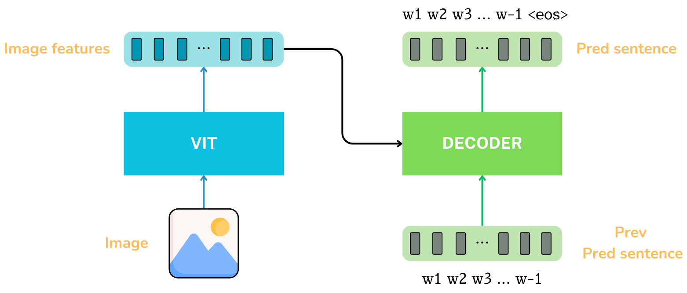
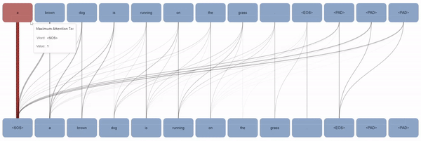
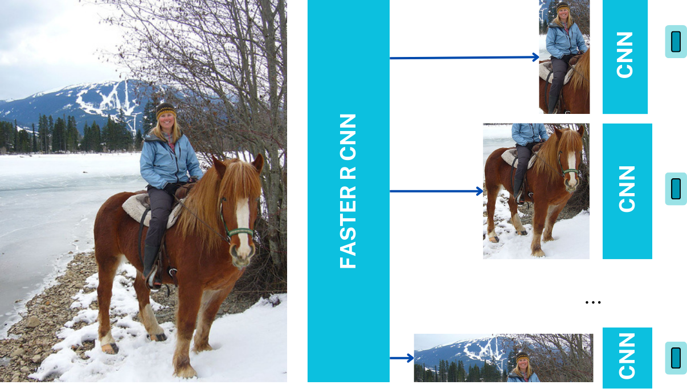
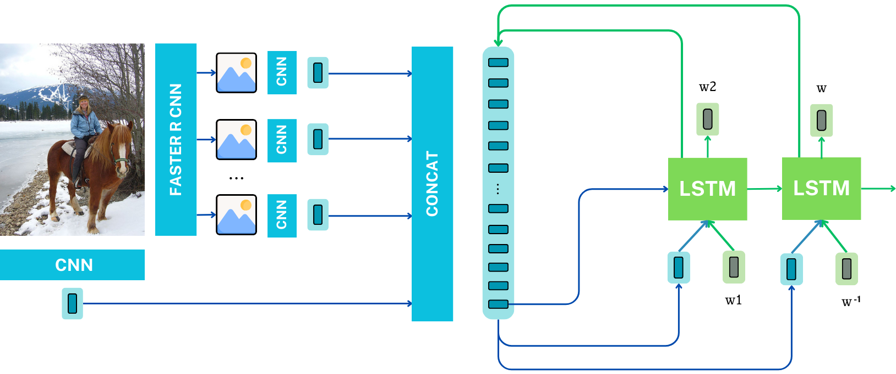
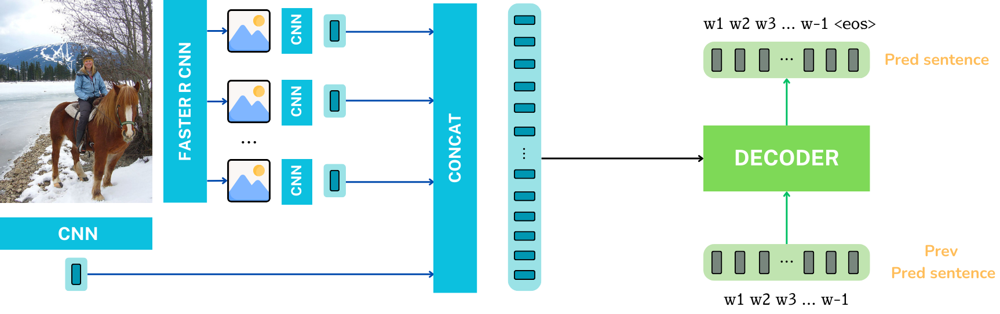

# Image Captioning

Welcome to the Image Captioning repository! Image captioning is an intriguing challenge that demands the generation of descriptive and precise sentences to encapsulate the content of an image. This repository serves as a comprehensive exploration into various image captioning methodologies, ranging from fundamental character and word-based approaches to advanced techniques utilizing attention mechanisms and transformer architectures.

These are some cations generated by our best model

## Baseline

The first approach we tried was using a CNN as an encoder and using the output of the pooler layer as input to a RNN, then keep generating words/characters based on the previous one and the hidden state. 

We provide an ableation study testing different backbones, freezing or not the CNN, using 5 or 1 caption as ground truth, etc. 

| Backbone | Element | Num captions |  Encode Freeze  | bleu1 | bleu2 | rougeL | meteor |
| :---------:|:--:|:------------:|    :---------:             | :---------:      |   :---------:    |    :---------:    |  :---------:      |
| Resnet   | char | 1            |   no           |    0.20  |    0.11   |    0.24    |    0.12    |
| Resnet   | char | 1            |    yes           |   0.11    |    0.06   |    0.26    |    0.11    |
| Resnet   | char | 1            |    until epoch 50  |   0.21    |    0.13   |    0.31    |    0.15    |
| Resnet   | word | 1            | no           |    0.54   |   0.30    |    0.36    |    0.32    |
| Resnet   | word | 5            |   no           |    0.54   |    0.28   |    0.36    |    0.22    |
| Resnet   | word | 1            |    yes           |   0.54    |    0.31   |    0.37    |    0.32    |
| Resnet   | word | 1            |    until epoch 50  |   0.55    |    0.31   |    0.38    |    0.31    |
| EfficientNet   | word | 1            |    until epoch 50  |   0.50    |    0.25   |    0.33    |    0.28    |
| ConvNext   | word | 1            |    until epoch 50  |   0.58    |    0.34   |    0.39    |    0.34    |

## Introducing Attention

### Cross Attention 

### Badhanau Attention 

Attention can be done over the input, hidden or output vector. To see more details about this you can go to *

**Results**

| Attention | Over what | bleu1 | bleu2 | rougeL | meteor |
| :---------:|:--: | :---------:      |   :---------:    |    :---------:    |  :---------:      |
| Cross Attention | Input | 54.85 | 32.27 | 37.71 | 33.49  |
| Cross Attention | Hidden | 55.97 | 31.48 | 38.21 | 32.39  |
| Cross Attention | Output | 51.74 | 29.68 | 36.64 | 27.81  |
| Badhanau Attention | Input | 57.19 | 34.4 | 39.3 | 34.81 |

The best model in this case was an LSTM, with 4 layers with Bahdanau attention over the input finetuning the CNN for 60 epochs with Convnext as starting backbone and with 15% dropout.  

**Attention Maps of the best model**

## Using Transformers
### CNN + Transformer Decoder

### VIT + Transformer Decoder

**Results**

| Architecture | bleu1 | bleu2 | rougeL | meteor |
| :---------: | :---------:      |   :---------:    |    :---------:    |  :---------:      |
| CNN + Transformer Decoder | 63.23 | 43.2 | 44.66 | 44.02  |
| VIT + Transformer Decoder | 65.06 | 45.17 | 45.67 | 44.62 |

The VIT model is the best model we have accomplished showing how strong this architecture is for image captioning. It comprises a Transformer decoder with 5 layers and 12 heads, utilizing teacher forcing with 5 captions during training. Leveraging pretrained word2vec embeddings and ViT as its backbone, the model undergoes finetuning after 20 epochs with a 10% dropout rate.

**Visualizing VIT attention over input words**   

## Introducing Regions 
Extracting information from a trained FasterRCNN can be done in different ways, using the CNN as a backbone, the ROI features, or using the predicted bounding boxes are some approaches. We decided to actually use the bounding boxes, crop the different detected objects, and pass them through a new CNN, then we can use these features as input to any type of decoder, in our case we show results for lstm and transformer decoders.  

### FasterRCNN + LSTM 

### FasterRCNN + Transformer Decoder

**Results**

| Architecture | bleu1 | bleu2 | rougeL | meteor |
| :---------: | :---------:      |   :---------:    |    :---------:    |  :---------:      |
| FasterRCNN + LSTM | 53.64 | 30.29 | 36.45 | 32.16  |
| FasterRCNN + Transformer Decoder | 56.20 | 29.82 | 37.29 | 22.79 |

