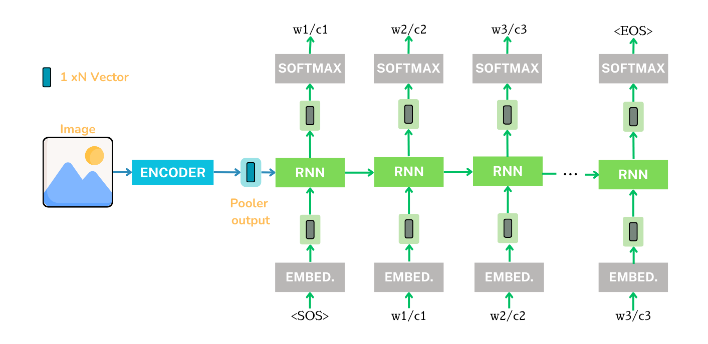
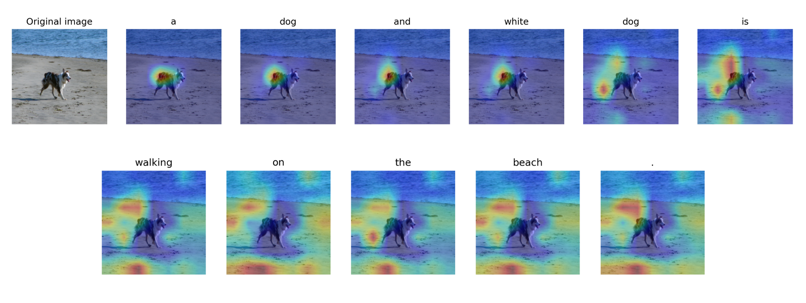

# Image Captioning

Welcome to the Image Captioning repository! Image captioning is an intriguing challenge that demands the generation of descriptive and precise sentences to encapsulate the content of an image. This repository serves as a comprehensive exploration into various image captioning methodologies, ranging from fundamental character and word-based approaches to advanced techniques utilizing attention mechanisms and transformer architectures.

These are some cations generated by our best model

## Baseline

The first approach we tried was using a CNN as an encoder and using the output of the pooler layer as input to a RNN, then keep generating words/characters based on the previous one and the hidden state. 

We provide an ableation study testing different backbones, freezing or not the CNN, using 5 or 1 caption as ground truth, etc. 

| Backbone | Element | Num captions |  Encode Freeze  | bleu1 | bleu2 | rougeL | meteor |
| :---------:|:--:|:------------:|    :---------:             | :---------:      |   :---------:    |    :---------:    |  :---------:      |
| Resnet   | char | 1            |   no           |    0.20  |    0.11   |    0.24    |    0.12    |
| Resnet   | char | 1            |    yes           |   0.11    |    0.06   |    0.26    |    0.11    |
| Resnet   | char | 1            |    until epoch 50  |   0.21    |    0.13   |    0.31    |    0.15    |
| Resnet   | word | 1            | no           |    0.54   |   0.30    |    0.36    |    0.32    |
| Resnet   | word | 5            |   no           |    0.54   |    0.28   |    0.36    |    0.22    |
| Resnet   | word | 1            |    yes           |   0.54    |    0.31   |    0.37    |    0.32    |
| Resnet   | word | 1            |    until epoch 50  |   0.55    |    0.31   |    0.38    |    0.31    |
| EfficientNet   | word | 1            |    until epoch 50  |   0.50    |    0.25   |    0.33    |    0.28    |
| ConvNext   | word | 1            |    until epoch 50  |   0.58    |    0.34   |    0.39    |    0.34    |

## Introducing Attention

### Cross Attention 

### Badhanau Attention 

### Attention over the input vector

### Attention over the hidden vector

### Attention over the output vector 

**Results**

| Attention | Over what | bleu1 | bleu2 | rougeL | meteor |
| :---------:|:--: | :---------:      |   :---------:    |    :---------:    |  :---------:      |
| | Input | 54.85 | 32.27 | 37.71 | 33.49  |
| | Hidden | 55.97 | 31.48 | 38.21 | 32.39  |
| | Output | 51.74 | 29.68 | 36.64 | 27.81  |

**Attention Maps of the best model**

